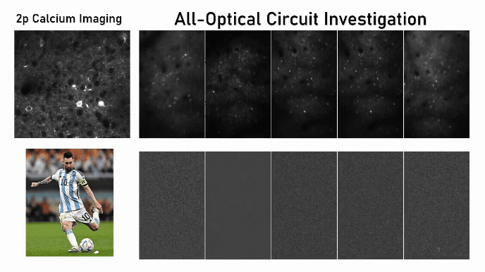

# Mora Ogando
_Postdoctoral Researcher, UC Berkeley_
Welcome to my academic webpage. I study cortical microcircuits, recurrent inhibition, and sensory representations using two-photon holographic optogenetics and Neuropixels recordings.  

*Combining two-photon calcium imaging to record neuronal activity, and two-photon holographic photostimulation in specific subsets of neurons, we can re-create specific neural codes to understand cognition.*

---

## 🔬 Research Overview
My research examines how brain circuits dynamically support flexible computations that give rise to adaptive behaviors and cognition at three levels:  
1. **Synaptic mechanisms** underlying input processing and plasticity.  
2. **Feature-specific population-level interactions** shaping sensory representations.  
3. **Learned sensory-motor codes** guiding decision-making.  

- **Ph.D. (Max Planck Buenos Aires):** Showed how adult neurogenesis, neuromodulation, and inhibitory microcircuits enable flexible hippocampal input processing.  
- **Postdoc (UC Berkeley):** Expanded all-optical read–write physiology to recreate sensory codes with high fidelity at scale, simultaneously recording thousands of neurons and perturbing hundreds of functionally defined neurons per second.  
- Using these powerful tools, I have causally dissected (and recreated) cortical computations such as feature completion and feature suppression, with a focus on functionally selective inhibitory circuits.  
- Ultimately, I aim to uncover the circuit principles that govern perceptually guided decisions in awake, behaving animals.  

---

## 🏅 Honors & Awards
- Weill Neurohub Postdoctoral Fellowship (2025)  
- Rising Star Trainee Fellowship, Salk Institute (2023)  
- BRAIN Initiative Trainee Highlight Award, NIH (2023)  
- Doupe Postdoctoral Fellowship, McKnight Foundation (2023)

---
## 📚 Publications
1. Shin, H., **Ogando, M. B.** et al. (2025). *Recurrent pattern completion drives the neocortical representation of sensory inference.* **Nature Neuroscience**, 1–11.  
2. Giusti, S. A., **Ogando, M. B.** et al. (2024). *A brain-enriched circular RNA controls excitatory neurotransmission and restricts sensitivity to aversive stimuli.* **Science Advances**, 10, eadj8769.  
3. Sridharan, S.\*, Gajowa, M.\*, **Ogando, M. B.**\*, Jagadisan, U.\* et al. (2022). *High-performance microbial opsins for spatially and temporally precise perturbations of large neuronal networks.* **Neuron**, 110(7), 1139–1155.e6.  
4. **Ogando, M. B.*** et al. (2021). *Cholinergic modulation of dentate gyrus processing through dynamic reconfiguration of inhibitory circuits.* **Cell Reports**, 36.  
5. Tomasella, E.,[…], **Ogando, M. B.** et al. (2018). *Deletion of dopamine D2 receptors from parvalbumin interneurons in mouse causes schizophrenia-like phenotypes.* **PNAS**, 115(13), 3476–3481.  
6. Pardi, M. B., **Ogando, M. B.**, Schinder, A. F., & Marin-Burgin, A. (2015). *Differential inhibition onto developing and mature granule cells generates high-frequency filters with variable gain.* **eLife**, 4, e08764.  

---

### Preprints
- **Ogando, M. B.** et al. (2025). *Feature-specific inhibitory connectivity augments the accuracy of cortical representations.* **bioRxiv**. 
- Abdeladim, L.*, Shin, H.*, Jagadisan, U. K.*, **Ogando, M. B.**, & Adesnik, H. (2023). *Probing inter-areal computations with a cellular-resolution two-photon holographic mesoscope.* **bioRxiv**.
---

## 🎤 Talks & Presentations
- Neuroscience Department Seminar, Berkeley, California (2025)  
- Salk Institute Rising Star Symposium, San Diego, California (2024)  
- Brain Initiative Conference,Rockville MD (2023)  

---

## 📫 Links
- [Google Scholar](https://scholar.google.com/citations?user=0TpnM0cAAAAJ&hl=es)  
- [ORCID](https://orcid.org/0000-0002-1453-2628)  
